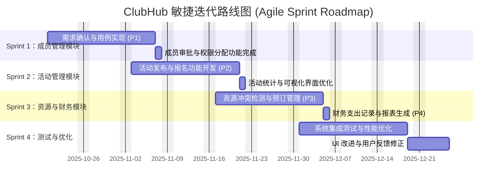

```mermaid
%%{init: {'themeVariables': { 'fontSize': '8px' }}}%%
gantt
    title ClubHub 敏捷迭代路线图 (Agile Sprint Roadmap)
    dateFormat  YYYY-MM-DD
    excludes weekends

    section Sprint 1：成员管理模块
    需求确认与用例实现 (P1)        :s1a, 2025-10-20, 14d
    成员审批与权限分配功能完成      :s1b, after s1a, 1d

    section Sprint 2：活动管理模块
    活动发布与报名功能开发 (P2)    :s2a, 2025-11-03, 14d
    活动统计与可视化界面优化        :s2b, after s2a, 1d

    section Sprint 3：资源与财务模块
    资源冲突检测与预订管理 (P3)    :s3a, 2025-11-17, 14d
    财务支出记录与报表生成 (P4)    :s3b, after s3a, 1d

    section Sprint 4：测试与优化
    系统集成测试与性能优化          :s4a, 2025-12-01, 14d
    UI 改进与用户反馈修正           :s4b, after s4a, 5d

```