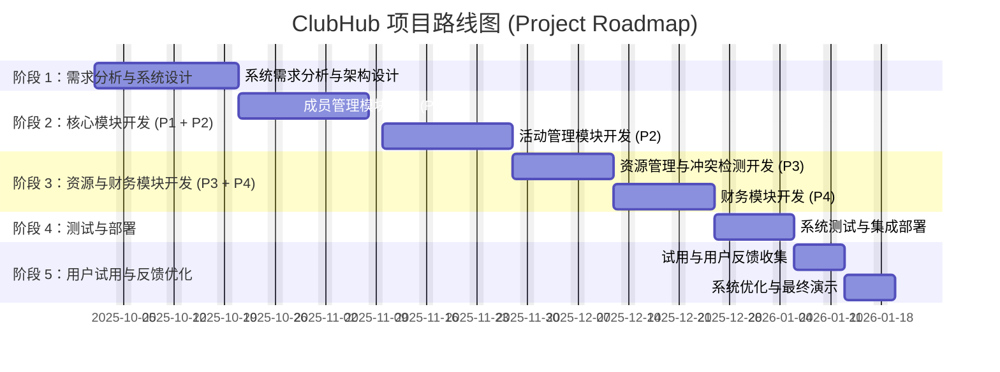

```mermaid
gantt
    title ClubHub 项目路线图 (Project Roadmap)
    dateFormat  YYYY-MM-DD
    excludes weekends

    section 阶段 1：需求分析与系统设计
    系统需求分析与架构设计       :a1, 2025-10-, 14d

    section 阶段 2：核心模块开发 (P1 + P2)
    成员管理模块开发 (P1)        :a2, after a1, 14d
    活动管理模块开发 (P2)        :a3, after a2, 14d

    section 阶段 3：资源与财务模块开发 (P3 + P4)
    资源管理与冲突检测开发 (P3)  :a4, after a3, 10d
    财务模块开发 (P4)            :a5, after a4, 10d

    section 阶段 4：测试与部署
    系统测试与集成部署           :a6, after a5, 7d

    section 阶段 5：用户试用与反馈优化
    试用与用户反馈收集           :a7, after a6, 5d
    系统优化与最终演示           :a8, after a7, 5d

```