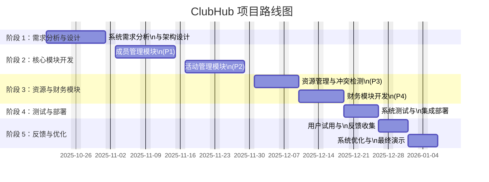

```mermaid
gantt
    title ClubHub 项目路线图
    dateFormat  YYYY-MM-DD
    excludes weekends

    section 阶段 1：需求分析与设计
    系统需求分析\n与架构设计       :a1, 2025-10-20, 10d

    section 阶段 2：核心模块开发
    成员管理模块\n(P1)             :a2, after a1, 10d
    活动管理模块\n(P2)             :a3, after a2, 10d

    section 阶段 3：资源与财务模块
    资源管理与冲突检测\n(P3)       :a4, after a3, 7d
    财务模块开发\n(P4)             :a5, after a4, 7d

    section 阶段 4：测试与部署
    系统测试与\n集成部署           :a6, after a5, 5d

    section 阶段 5：反馈与优化
    用户试用与\n反馈收集           :a7, after a6, 4d
    系统优化与\n最终演示           :a8, after a7, 4d

```